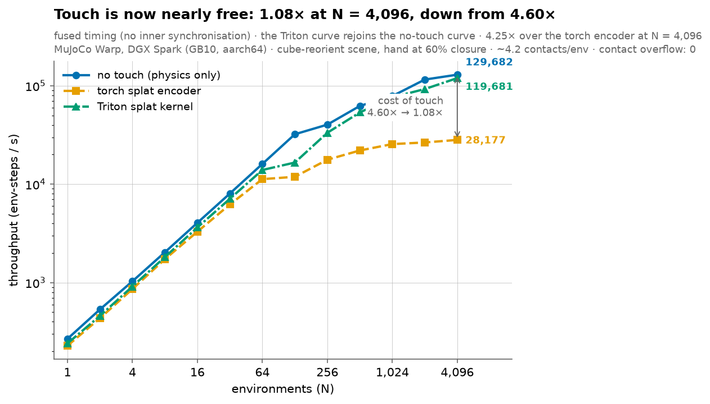
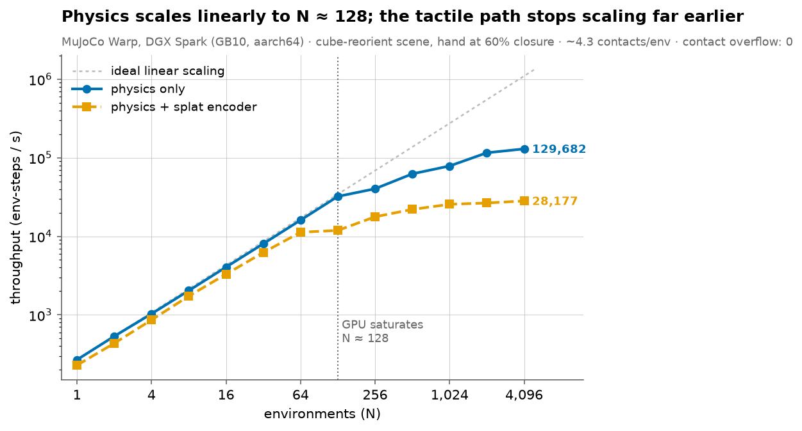
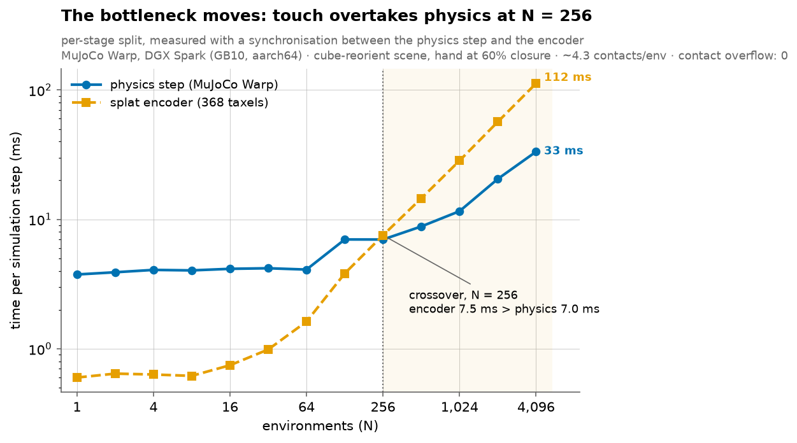
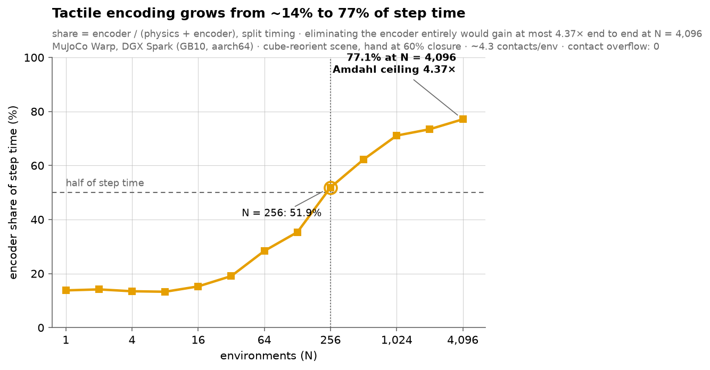
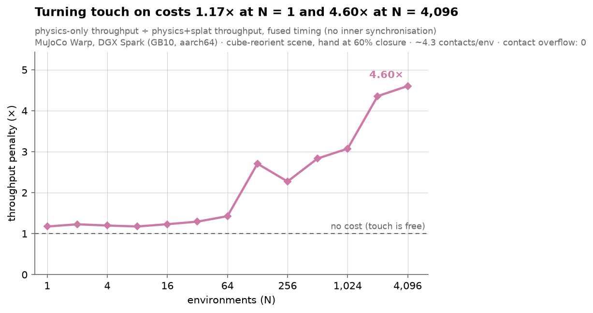
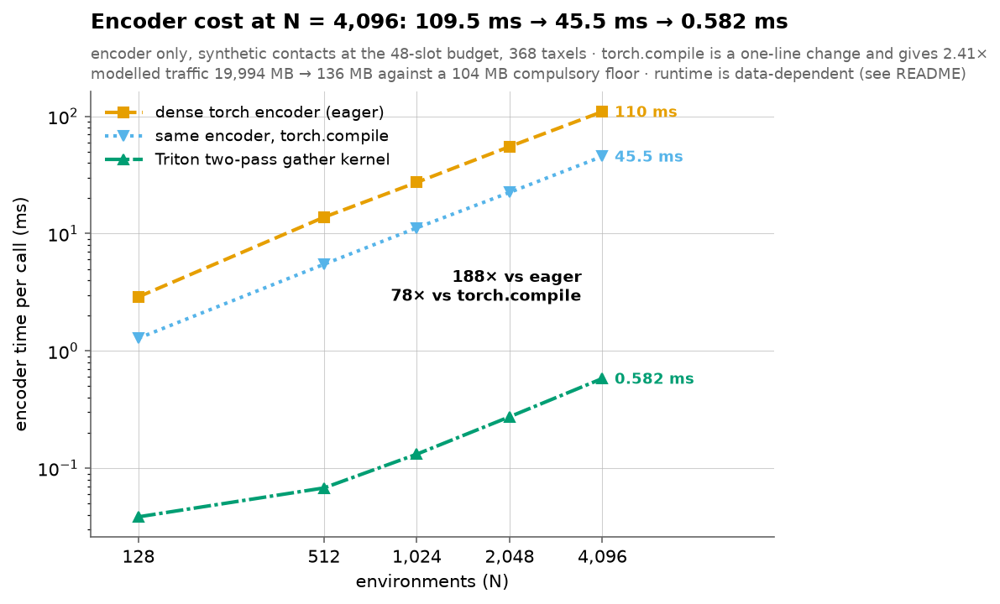
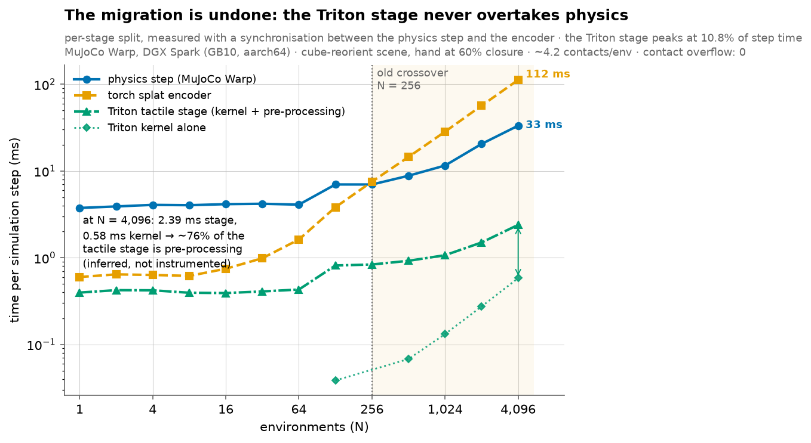
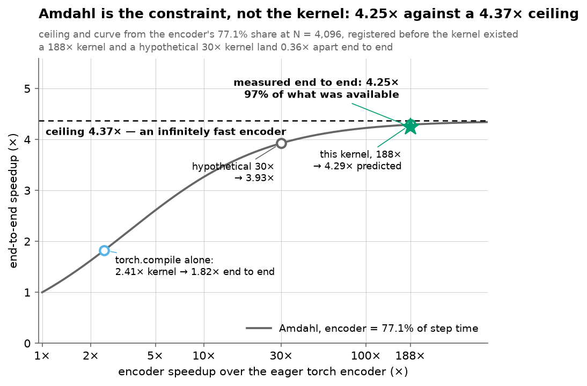

# Tactile observations at training scale

**What does touch cost when you simulate thousands of hands at once, and can you
make it cost nothing?**

This repository measures the cost of hardware-faithful tactile sensing inside a
GPU-parallel MuJoCo Warp simulation of the LeapXELA hand, locates the env count
at which the tactile encoder — not the physics — becomes the bottleneck, and then
removes it with a hand-written Triton kernel.

**Headline result:** on an NVIDIA DGX Spark (GB10), a faithful batched port of the
368-taxel Gaussian-splat encoder reaches **77.1% of step time at N = 4096**, where
turning touch on costs a **4.60×** throughput penalty. Because the encoder is
77.1% of the step, removing it entirely would gain at most **4.37×** end to end —
the Amdahl bound, stated before any optimisation was attempted. A two-pass Triton
gather kernel then makes the encoder **188× faster than eager torch and 78× faster
than `torch.compile`** (109.5 ms → 45.5 ms → 0.582 ms per call at N = 4096),
which against that **4.37× ceiling** delivers **4.25× end to end** — 97% of
everything that was available. Throughput goes 28,177 → **119,681 env-steps/s**
against a **129,682** physics-only ceiling, so **the cost of touch falls from
4.60× to 1.08×**.



---

## 1. The gap

The supervisor's GPU training stack (`leapXelaMjLab`, mjlab + MuJoCo Warp +
multi-GPU PPO) trains cube reorientation on a *tactile* hand at 4096
environments, and its observation set — joint positions and velocities, cube pose
error, cube velocities, fingertip positions — contains no tactile term of any
kind. The same lab's `leapXELA_model` holds the reference 368-taxel
Gaussian-splat encoder (`VirtualTaxelSensor`) — the correctness standard used
throughout this repo — but it is a per-contact Python loop that runs on CPU,
against a *different* hand model lineage. That hardware-faithful splat
encoder — 3 channels per taxel, no added collision geoms, taxel indices equal to
real XELA hardware IDs — does not exist on GPU anywhere, and nobody has measured
what it costs at training scale.

**Not overclaimed:** native MuJoCo `<touch>` sensors *do* already run on GPU —
`mujoco_warp/_src/sensor.py` implements `_sensor_touch`, dispatched over
`(naconmax, n_touch_sensors)`. What is missing is (a) the splat representation on
GPU and (b) the cost measurement for any representation at scale. Prior art
`langxin11/contactile_mjlab` puts tactile observations in mjlab, but for a
Robotiq 2F-85 gripper with 18 built-in `<force>` sensors on added sphere geoms —
a different robot, a different representation, and no scaling study.

## 2. Status

H1, H2 and H6 are resolved (`HYPOTHESES.md`); H3, H4 and H5 are open. The
measurement infrastructure, the correctness-validated GPU baseline, the profiling
verdict and the optimised kernel all exist. Everything below is measured on this
hardware, for this scene, and is reported as such.

## 3. What was built

| Component | File | What it is |
|---|---|---|
| **Tactile→RL body map** | `explore/taxel_map.py` | The two model lineages share **zero** body names. `BODY_MAP` is derived from the kinematic tree, disambiguated by the layout's own hardware patch names, and validated by body-local mesh bounding box: **8 of 12 bodies match to 0.000 mm**. Chain order is reversed from what the names suggest — `finger` is the *ring* finger — so mapping by name order silently swaps index and ring. |
| **Taxel injection** | `explore/03_inject_taxels.py`, `benchmarks/harness.py:build_scene_model` | 368 sites added to the pinned rigid mjlab model through **`MjSpec`** (67 → 435 sites). mjlab builds its hand through `MjSpec` too, so this transfers into an mjlab `spec_fn` nearly verbatim. Burial was measured by per-body ray cast: max 5.00 mm against the encoder's 10 mm patch-locality gate, so every taxel can still fire. |
| **Oracle fixture** | `explore/04_run_encoder.py` → `explore/out/oracle_fixture.npz` | 30 frames through a scripted grasp, storing the reference encoder's **inputs** (contact pos/frame/geoms/6-vector force, site poses, qpos) beside its 368×3 outputs. Any later implementation is validated without re-running MuJoCo, which sidesteps the Warp-vs-CPU contact discrepancy for pure encoder validation. Includes 8 `ncon = 0` frames. |
| **Benchmark harness** | `benchmarks/harness.py`, `benchmarks/scale_sweep.py` | One env count per memory-capped child process, because this box has unified CPU/GPU memory and an oversized run wedges the host rather than raising `CUDA out of memory`. Warmup, `wp.synchronize()` on both sides of the clock, contact counts and overflow reported every run. Two timing passes: fused (headline throughput) and stage-synchronised (the physics/encoder split). `--encoder {torch,compile,triton}` selects the implementation; everything else is held fixed. |
| **Batched torch encoder** | `src/encoders/taxel_torch.py` | Faithful batched port of `VirtualTaxelSensor.update`: dense `(B, C, T)` tensors, no fused kernels, no sparsity. Deliberately unoptimised — its cost is the baseline every later implementation is measured against. |
| **GPU contact plumbing** | `benchmarks/harness.py:SplatEncoder` | Warp keeps contacts in one flat `naconmax` array tagged by `worldid`, unordered; the encoder wants a dense per-env batch. Bucketing is done with a **stable sort**, not atomic counters — slot order then fixes the summation order, so the output is reproducible rather than wobbling at the 1e-7 level. |
| **Profiling harness** | `profiling/profile_encoder.py`, `profiling/RESULTS.md` | Per-op CUDA table joined against a hand-derived byte/FLOP cost model, plus *measured* DRAM and SGEMM ceilings for this machine, plus a controlled `torch.compile` experiment. It is what told the kernel what to do. |
| **Triton kernel** | `src/kernels/triton/taxel_triton.py` | Two-pass gather, recomputing weights. Drop-in replacement for `encode_taxels`, same signature and same semantics. Nothing of shape `(B, C, T, ·)` is ever created. |

Two failure modes are worth recording because both produce plausible-looking
output rather than an error:

- `VirtualTaxelSensor` groups taxels by `mj_name2id(entry.body)`. With
  tactile-lineage names against the RL model, every lookup returns −1, all 368
  taxels collapse into one bogus group, and **the encoder returns all zeros
  without raising**. Fixed by remapping the *layout* (`remap_layout`), leaving
  the reference encoder byte-for-byte intact because it is the oracle.
- `njmax` is **per world** in `mjw.put_data` while `naconmax` is a **total**.
  Scaling `njmax` by N made the dense solver O(N²) and throughput *fell* with
  scale: N = 512 went 337 → 67,840 env-steps/s on fixing it.

## 4. Results

Scene: `scene_mjx_cube.xml` from the pinned mjlab assets, hand closed to 60% of
its control range and settled 250 steps so contacts are live (~4.3 contacts/env),
`nconmax = 48/env`, `njmax = 120/env`, 100 timed steps after 30 warmup steps.
**Zero contact-budget overflow and zero dropped contacts at every N, in all three
sweeps.**

### 4.1 H1 — physics dominates when tactile is off → scaling half **confirmed**

`benchmarks/results/scale_sweep_physics_only.csv`:

| N | env-steps/s | µs/env-step | ms/step | peak GB |
|---|---|---|---|---|
| 1 | 268 | 3731.5 | 3.73 | 0.82 |
| 16 | 4,051 | 246.8 | 3.95 | 0.82 |
| 128 | 32,164 | 31.1 | 3.98 | 0.82 |
| 256 | 40,289 | 24.8 | 6.35 | 0.82 |
| 1024 | 78,550 | 12.7 | 13.04 | 0.82 |
| 4096 | **129,682** | **7.7** | 31.58 | **0.92** |

Scaling is linear to N = 128 — `ms/step` is flat at ~3.95 ms while throughput
doubles at every rung, i.e. 128 environments cost the same wall-clock as one.
Past that the GPU saturates and `ms/step` climbs, though throughput still improves
sublinearly to 4096. Per-env cost falls 484× from N = 1 to N = 4096.

This also **refuted a scope decision**: D7 assumed the Spark's unified memory
would set the env ceiling. 4096 physics environments use 0.92 GB peak RSS. Memory
was nowhere near binding, and all 13 rungs completed with no failures. The host
crash that motivated D7 was real but was not caused by physics memory at 4096;
its cause is still unidentified, so the memory cap and subprocess isolation stay.



### 4.2 H2 — a naive splat encoder overtakes physics in N ∈ [64, 1024] → **confirmed at N = 256**

`benchmarks/results/scale_sweep_splat.csv` against the physics-only sweep,
identical scene and settings:

| N | physics-only/s | splat/s | slowdown | physics ms | encoder ms | encoder % |
|---|---|---|---|---|---|---|
| 1 | 268 | 228 | 1.17× | 3.75 | 0.60 | 13.8% |
| 16 | 4,051 | 3,293 | 1.23× | 4.15 | 0.75 | 15.2% |
| 64 | 16,055 | 11,259 | 1.43× | 4.09 | 1.62 | 28.4% |
| 128 | 32,164 | 11,881 | 2.71× | 6.99 | 3.82 | 35.3% |
| **256** | 40,289 | 17,723 | 2.27× | 6.99 | **7.54** | **51.9%** ← crossover |
| 512 | 62,364 | 22,005 | 2.83× | 8.82 | 14.53 | 62.2% |
| 1024 | 78,550 | 25,555 | 3.07× | 11.57 | 28.43 | 71.1% |
| 4096 | 129,682 | 28,177 | **4.60×** | 33.33 | **112.26** | **77.1%** |



The mechanism is straightforward. Physics amortises with scale — between N = 1
and N = 4096 it does 4096× the work for **8.9×** the time (3.75 → 33.33 ms) —
while the dense `B × C × T` encoder does not: every environment × 48 contact
slots × 368 taxels, work proportional to N with no reuse, 0.60 → 112.26 ms, a
factor of **187**.





### 4.3 The Amdahl ceiling — 4.37×, fixed before any kernel existed

At N = 4096 the encoder is 77.1% of step time. Eliminating it **entirely** —
making tactile encoding free — therefore caps end-to-end speedup at

> 1 / (1 − 0.771) = **4.37×**

This was written down before any kernel existed, because it is the number every
later result has to be reported against. A kernel that makes the encoder 10×
faster does not make the step 10× faster: it leaves 22.9% + 7.7% of the original
step, i.e. **3.3×** end to end. The same arithmetic says a 20× kernel gives
3.74×, a 30× kernel gives 3.93×, and a 100× kernel gives 4.23× — so going
30× → 100× buys **7.6% more end-to-end throughput for 3.3× more kernel
performance**. That was recorded as a stopping rule, in advance, and it is what
§4.7 concludes with.

Memory never bound the tactile path either: torch peak 4.06 GB and process peak
1.72 GB at N = 4096.

### 4.4 Why the encoder was slow — the profiling verdict

Full report: `profiling/RESULTS.md`. The short version, because it dictated the
kernel design rather than merely preceding it:

- **Bandwidth-bound, decisively.** Arithmetic intensity **0.192 FLOP/byte**
  against a *measured* ridge point of **70.7 FLOP/byte** for this GB10 — 368× to
  the left. It runs at **183.9 GB/s**, 71% of the measured 260.8 GB/s DRAM
  ceiling, and **0.19%** of the measured 18.44 TFLOP/s SGEMM ceiling.
- **The traffic is 19.99 GB per call at N = 4096, and 99.3% of it is multiplied
  by zero after having been written to DRAM and read back.** 72.4M
  (env, contact, taxel) triples are computed; ~492k carry signal. Two masks throw
  the rest away: ~3.9 live contacts against a 48-slot budget, then a body mask
  that keeps 1/12 of the taxels.
- **Launch overhead is 0.18% of the call** (58 launches × 3.34 µs). Any design
  justified on "fewer kernel launches" is justified on the wrong grounds — so the
  kernel below does *not* try to be a single kernel.
- **The controlled experiment.** `torch.compile` on the *unmodified* encoder
  changes zero FLOPs, zero algorithm and zero occupancy strategy; it removes only
  DRAM round trips, and it is **2.41× faster** at N = 4096, numerically identical
  to 4.8e-07. That is the cleanest available proof that traffic is the limiter,
  and it also fixes the honest baseline: **2.41× is available from one line of
  code**, worth 1.82× end to end, so the Triton kernel is reported against
  `torch.compile` as well as against eager.
- **H6's stated mechanism was refuted.** H6 predicted the win would come from
  replacing a scatter's atomic contention with a gather. **Atomics never appear
  in the profile.** The gather is still the right formulation, but because it is
  the one that makes it natural never to materialise `(B, C, T, ·)` and never to
  visit the 99.3% — not because of contention.
- The compulsory traffic floor — inputs plus output, nothing else — is
  **103.8 MB**, i.e. 193× less than what the dense encoder moves.

### 4.5 The kernel

`src/kernels/triton/taxel_triton.py`. Two-pass gather, recomputing weights rather
than storing them.

The two-pass split is **forced, not preferred**: `weights /= weights.sum()`
reduces over the taxel axis, and the taxel axis is pass 2's parallel axis, so
pass 2 cannot compute its own denominator. The same argument independently kills
the one-pass scatter alternative.

- **Pass 1** — one program per `(env, contact)`. Walks that contact's body's
  taxels, computes each Gaussian weight exactly as the reference does, writes a
  single float `weight_sum[B, C]`. No collisions, no atomics.
- **Pass 2** — one program per `(env, taxel tile)`. Loads the tile's site pose
  once, loops the env's contact slots, recomputes the weight, divides by
  `weight_sum`, rotates the contact wrench into the taxel frame, and accumulates
  **in registers**. Three stores at the end.

Recompute beats store because traffic costs ~368× what FLOPs cost here; the only
thing that reaches DRAM between the passes is one float per `(env, contact)` —
786 KB at N = 4096. Tile sizes (`BLOCK_T` = 64 for pass 1, 32 for pass 2) were
chosen by a measured 3×3 sweep, not by taste.

`benchmarks/results/kernel_bench.csv`, encoder only, 48-slot budget, 368 taxels:

| N | eager | `torch.compile` | **Triton** | vs eager | vs compile | GB/s | % of measured ceiling |
|---|---|---|---|---|---|---|---|
| 128 | 2.887 | 1.282 | **0.038** | 74.9× | 33.3× | 110.3 | 42.3% |
| 512 | 13.792 | 5.474 | **0.068** | 203.2× | 80.7× | 250.5 | 96.1% |
| 1024 | 27.340 | 11.196 | **0.132** | 207.5× | 85.0× | 258.1 | 99.0% |
| 2048 | 55.177 | 22.437 | **0.274** | 201.1× | 81.8× | 247.8 | 95.0% |
| 4096 | 109.525 | 45.536 | **0.582** | **188.2×** | **78.3×** | 233.8 | 89.6% |



Modelled traffic at N = 4096 falls **19.99 GB → 136 MB**, against the 103.8 MB
compulsory floor — 1.31× the floor, and 147× less than eager. Peak torch
allocation falls **4.095 → 0.183 GB**. This exceeds the 20–40× projected in
`profiling/RESULTS.md`; the discounts that projection assumed (register spills,
load imbalance, a 48-SM tail) did not materialise.

**Determinism, now measured.** 20 runs at B = 1024 on identical input, compared
with `torch.equal` over 1,130,496 floats: **20/20 bit-identical**. Both passes
accumulate in registers in a fixed order and neither uses atomics.
`profiling/RESULTS.md` had recorded H6's determinism claim as supported by
construction but never measured, because the existing torch path is already
deterministic (it sorts rather than using atomics). `tests/test_triton_kernel.py`
measures it.

### 4.6 End to end — touch is now nearly free

`benchmarks/results/scale_sweep_splat_triton.csv`, same scene and settings, the
kernel wired into the harness behind `--encoder triton`, correctness re-gated
in-harness at **1.49e-07** before any timing was recorded.

Against the **4.37× Amdahl ceiling** established in §4.3:

| N | no touch | torch splat | **Triton splat** | cost of touch | vs torch |
|---|---|---|---|---|---|
| 64 | 16,055 | 11,259 | 13,939 | 1.15× | 1.24× |
| 256 | 40,289 | 17,723 | 33,301 | 1.21× | 1.88× |
| 1024 | 78,550 | 25,555 | 76,349 | **1.03×** | 2.99× |
| 4096 | 129,682 | 28,177 | **119,681** | **1.08×** | **4.25×** |

**The cost of tactile sensing at 4096 envs falls from 4.60× to 1.08×** — from a
360% penalty to 8%. The end-to-end gain of **4.25×** is **97% of the 4.37× that
was available**. The encoder's share of step time drops from **77.1% to 6.5%**.
In-harness torch peak allocation drops 4.06 → 0.12 GB.



The migration H2 found is undone: the Triton tactile stage never overtakes the
physics step at any N in the sweep, peaking at 10.8% of step time.

### 4.7 Amdahl is now the whole story



Plugging the measured kernel speedup into the 77.1% share gives 4.29× predicted;
the sweep measured 4.25×. Those agree, which is the check worth having — the
end-to-end number is not doing anything the stage split does not already explain.

The point of the figure is the flatness on the right. A **188×** kernel and a
hypothetical **30×** kernel land **0.36× apart** end to end (4.29× vs 3.93×),
because both are already deep into the ceiling's shadow. **The remaining ~10% of
end-to-end throughput lives entirely in the physics step.** Further tuning of
this kernel is not worth the days, and that conclusion was pre-registered in
§4.3 rather than reached after the fact.

### 4.8 What this kernel result does *not* claim

Every one of these is a limitation of the measurement, and each is recorded in
`HYPOTHESES.md` H6.

- **Runtime is now data-dependent, and the headline is tied to this scene's
  contact count.** The dense baseline's cost was independent of how many contacts
  were live; the sparse kernel's is not. Measured at N = 4096: **0.54 ms at 1
  live contact/env, 0.57 ms at the real ~4.3, 0.73 ms at 12, and 1.27 ms with all
  48 slots live.** The fully saturated worst case is still **86× eager / 36×
  `torch.compile`**, so the conclusion survives, but the 188× figure does not
  transfer to a harder grasp. The profiling report's "synthetic inputs are
  performance-equivalent to real ones, ratio 1.0006" result was established for
  the dense encoder and **does not carry over to this kernel**.
- **Read the 96–99%-of-ceiling figures at N = 512–2048 with suspicion.** Every
  achieved-GB/s number in this repository is *modelled bytes ÷ measured time*,
  not a counter read. At mid-N that ratio lands within a few percent of the DRAM
  ceiling, which almost certainly means **L2 reuse is being charged as DRAM
  traffic**, not that the wall was approached. **89.6% at N = 4096 is the
  defensible figure**; the mid-N numbers are reported because deleting them would
  be worse, not because they should be believed.
- **There is no Nsight-reported limiter anywhere in this work.** `ncu` returns
  `ERR_NVGPUCTRPERM` on every section, including `LaunchStats` and `Occupancy`:
  the driver is built with `NVreg_RestrictProfilingToAdminUsers=1` and there is
  no passwordless root on this box. Substituted throughout: an empirically
  measured saturating-copy bandwidth ceiling (260.8 GB/s read, 240.7 copy, 237.6
  triad), an SGEMM compute ceiling (18.44 TFLOP/s, TF32 off), and modelled bytes
  ÷ measured time. `nsys` does work and corroborates the kernel-level picture.
  The `torch.compile` experiment in §4.4 exists precisely because it tests the
  same conclusion without needing counters.
- **The bottleneck has migrated a second time, one level down, and the split is
  inferred rather than instrumented.** At N = 4096 the harness reports **2.393 ms
  for the tactile stage**, while the kernel alone measures **0.582 ms**. The
  remaining ~1.8 ms is the stage's pre-processing: fetching contact forces from
  Warp (`mjw.contact_force`) and scattering the flat `naconmax` contact array into
  the padded per-env `(B, C, ·)` layout. That makes pre-processing **~75% of the
  tactile stage**. **This split is inferred from two separately measured numbers
  and has not been directly instrumented** — the two were taken on different input
  paths (in-harness vs. the encoder-only bench), so it should be measured directly
  before being quoted anywhere else. It is this project's own thesis recurring one
  level down, and it is the cheapest remaining target.
- **On recompute vs. store, honestly:** in a fully body-sparse layout the stored
  weight buffer would be only ~2 MB, so store's bandwidth penalty largely
  evaporates and the two designs come close on speed. Recompute still wins there,
  but on simplicity and footprint — no second buffer, no index structure, no
  `O(B·C·T)` allocation — rather than on bandwidth.

## 5. Correctness

Timing is only worth reporting if the answer is right, and the documented failure
mode here is a *fast wrong answer* (all-zero taxels, or forces attributed to the
wrong finger). Every check below ran before the timing it accompanies.

| Check | What it compares | Result |
|---|---|---|
| Batched torch encoder vs CPU reference | `tests/test_encoder_oracle.py`, all 30 oracle frames | **2.4e-06 max abs error** (5.5e-06 max relative), on peak per-channel forces of **5.4 N** |
| Batching vs per-frame | 30 frames padded into one B=30 batch vs one at a time | **bit-identical** (0.0e+00) — the padding and masking are inert |
| GPU torch path vs CPU encoder, identical contacts | `benchmarks/harness.py --verify`, check A (gate) | **1.5e-08 max abs error** |
| GPU torch path vs `VirtualTaxelSensor` on a CPU re-solve | check B (reported, not gated) | **3.8e-03** — Warp and CPU MuJoCo generate different contact sets for the same state; an engine difference, not an encoder bug |
| **Triton kernel vs the oracle fixture** | `tests/test_triton_kernel.py` | **1.94e-06 max abs error** |
| **Triton kernel vs the real Warp contact stream** | same test, N = 64 | **1.34e-07** |
| **Triton kernel, re-gated in-harness before the sweep** | `--encoder triton --verify` | **1.49e-07** |
| **Triton kernel determinism** | 20 runs, B = 1024, `torch.equal` over 1,130,496 floats | **20/20 bit-identical** |
| `torch.compile` vs eager | `profiling/profile_encoder.py --mode fusion` | **4.8e-07** — numerically identical, as it must be |

The reference accumulates in float64 and casts to float32 on return; both GPU
implementations run in float32 throughout, so agreement is to float32 rounding
rather than bit-exact. The Triton kernel additionally sums the weights and the
contact accumulation in a different order from the torch version, and float
addition is not associative, so the two are *not* expected to be bit-identical to
each other — 1.94e-06 against the oracle is consistent with float32 rounding on
peak per-channel forces of 5.4 N.

The kernel's edge cases are tested individually rather than assumed, because each
skip it performs is an opportunity to be plausibly wrong: `ncon = 0` (exact
zeros, not NaN from a 0/0 normalisation, and not a launch of an empty grid); a
contact whose `weight_sum` is 0 because it is gated out; padding slots holding
live-looking junk in `contact_pos`/`contact_force`; and a contact on a body
carrying no taxels at all.

**Limitation, stated plainly:** the oracle fixture is narrow. Across its 30
frames only **37 of 368 taxels ever fire**, and **31 of those are on the palm** —
4 on proximal links and **2 on fingertips**. Contacts do occur on the finger
links, but each 4×4 pad covers one face, so a contact on an uncovered face
correctly yields zero weight and is skipped. The fixture therefore exercises the
palm path well and the fingertip path barely. This applies to the Triton kernel
exactly as it applied to the torch one — the kernel is validated against a
fixture that does not load the fingertips.

## 6. Known limitations

- **136 of 368 taxels sit on a geometrically different part.** The tactile and RL
  model lineages carry different fingertips: the RL tip is ~10.3 mm longer
  (tactile lineage 30 × 61.98 × 34.6 mm; RL lineage 34.85 × 72.31 × 39.2 mm),
  and identically so across all three mjx variants, so this is not a
  fingertip-variant choice. The mounting frame agrees exactly — faces at `min_x`, `max_y`,
  `min_z` align — so the 232 palm/proximal/middle taxels transfer with no
  transform, but the *lateral* placement of the 136 fingertip taxels is
  unverified against the physical robot. This affects sim-to-real fidelity, not
  throughput or bottleneck location. It is an open question for the supervisor:
  which tip is the real robot, and is there a variant matching the sensorised tip?
- **The benchmark measures physics + encoder, not the full training loop.** It
  drives `mujoco_warp` directly on the mjlab scene; there is no policy, no
  optimiser, no rollout buffer, no logging. Encoder share, the 4.37× ceiling and
  the 4.25× achieved against it are all properties of the *simulation* step;
  adding the RL machinery will lower every one of them, and it will lower the
  headline "touch is nearly free" claim by making the tactile stage a smaller
  slice of a bigger step. The tactile term is also not yet wired into mjlab as an
  `ObservationTermCfg`.
- **The submodule is deliberately pinned** — the `leapXELA_model` copy vendored
  inside `leapXelaMjLab` sits at `4e8003f` (2026-06-11). Current `main` replaces `leapXela_generated_mjx_Box.xml` — same
  filename — with a **385-body, 1129-joint, 368-constraint flex hand**, whose 368
  taxels sit one per flex body. That breaks the splat's group-by-body assumption
  (the splat would degenerate to one taxel per contact) and would trigger the
  flex hypothesis H4 by accident, unmeasured. It would also invalidate the
  kernel's body-segment skip, which is where a factor of ~12 comes from. Bumping
  the submodule swaps the robot; do it deliberately or not at all.
- **One machine, one scene, one contact regime.** All numbers are DGX Spark GB10,
  cube-reorient, ~4.3 contacts/env. The crossover point is a property of this
  hardware and this scene, not a universal constant — and now that the kernel's
  runtime is data-dependent, so is the 188×. The 4096-env *training* point is
  untested here; only 4096-env simulation is.
- **The stage split costs something to measure.** The physics/encoder breakdown
  comes from a second pass that synchronises between the two stages, draining the
  pipeline twice per step; it is therefore an upper bound on the fused cost. The
  headline throughput and cost-of-touch numbers come from the fused pass, with no
  inner synchronisation.
- **H3, H4 and H5 are unresolved.** No touchgrid measurement, no flex
  measurement, and no memory-ceiling result with the training loop attached.

## 7. Reproduction

### Environment

| | |
|---|---|
| Hardware | NVIDIA DGX Spark, GB10, 48 SMs, sm_121, `aarch64`, ~121 GB **unified CPU/GPU** LPDDR5X |
| Kernel | `6.17.0-1029-nvidia` |
| Python | 3.12.3 |
| mujoco | 3.11.0 |
| mujoco_warp | 3.11.0 |
| warp-lang | 1.16.0 |
| torch | 2.13.0+cu130 |
| triton | 3.7.1 (installed with torch) |
| numpy | 2.5.2 |
| CUDA | 13.0 (nvcc 13.0.88) |
| matplotlib | 3.11.1 (figures only) |

> **Unified memory warning.** There is no separate VRAM;
> `nvidia-smi --query-gpu=memory.total` returns `[N/A]`. An oversized allocation
> does not raise `CUDA out of memory` — it exhausts host RAM, the OOM killer
> starts killing system daemons, and the machine wedges (this happened once, on
> 2026-08-13). **Cap every run.** Rendering is headless via EGL: set
> `MUJOCO_GL=egl` before importing mujoco (the scripts here do it themselves).

### Setup

```bash
git clone --recurse-submodules <this repo> && cd Mujoco
python3 -m venv .venv
.venv/bin/pip install mujoco==3.11.0 mujoco-warp==3.11.0 numpy==2.5.2 matplotlib==3.11.1
# torch must be the aarch64 CUDA 13.0 build (2.13.0+cu130 here), not the default
# wheel; Triton comes with it
```

The submodule URL is SSH (`git@github.com:...`); without a key on the box, use
`git config --global url."https://github.com/".insteadOf git@github.com:`.

### Correctness first

```bash
# batched encoder vs the banked CPU oracle (CPU only, seconds)
PYTHONPATH=third_party/leapXELA_model:explore \
  systemd-run --user --scope -q -p MemoryMax=16G -p MemorySwapMax=0 \
  .venv/bin/python tests/test_encoder_oracle.py

# the Triton kernel vs the oracle, vs the torch encoder, edge cases, determinism
systemd-run --user --scope -q -p MemoryMax=40G -p MemorySwapMax=0 \
  .venv/bin/python tests/test_triton_kernel.py

# either GPU tactile path vs the CPU reference, at a small env count
systemd-run --user --scope -q -p MemoryMax=16G -p MemorySwapMax=0 \
  .venv/bin/python benchmarks/harness.py --num-envs 4 --tactile splat \
  --encoder triton --verify
```

`harness.py` puts `src/`, `explore/` and `third_party/leapXELA_model` on
`sys.path` itself, so it needs no `PYTHONPATH`; the test's `PYTHONPATH` above
matches its own docstring.

### The profiling

```bash
CAP="systemd-run --user --scope -q -p MemoryMax=40G -p MemorySwapMax=0"
$CAP .venv/bin/python profiling/profile_encoder.py --mode bandwidth
$CAP .venv/bin/python profiling/profile_encoder.py --mode bench --num-envs 4096 \
     --bandwidth --iters 10 --profile-calls 3
$CAP .venv/bin/python profiling/profile_encoder.py --mode fusion --num-envs 4096 --iters 10
```

`--mode ncu` exists but `ncu` itself cannot read a counter on this box; see §4.8.

### The sweeps

`scale_sweep.py` runs `harness.py` once per env count in its own
`systemd-run --scope` with a hard `MemoryMax`, so an out-of-memory kills a child
rather than the host. A failure at some N is a result — the ceiling — not a crash.

```bash
# H1 control: bare physics, N = 1 .. 4096
.venv/bin/python benchmarks/scale_sweep.py \
  --max-envs 4096 --mem-cap 60 --tactile none --tag physics_only

# H2: physics + the dense torch splat encoder, same ladder
.venv/bin/python benchmarks/scale_sweep.py \
  --max-envs 4096 --mem-cap 60 --tactile splat --tag splat

# H6: the same ladder with the Triton kernel
.venv/bin/python benchmarks/scale_sweep.py \
  --max-envs 4096 --mem-cap 60 --tactile splat --encoder triton --tag splat_triton
```

Each writes `benchmarks/results/scale_sweep_<tag>.csv`. Run inside `tmux` so a
dropped SSH connection does not kill the job.

`benchmarks/results/kernel_bench.csv` — the encoder-only eager /
`torch.compile` / Triton comparison in §4.5 — is banked from the kernel bring-up
run of 2026-08-13. Its driver script is not checked in, so unlike the three
sweeps above it cannot be regenerated by a command in this repository; the CSV is
the record. `tests/test_triton_kernel.py` reproduces the correctness and
determinism half of that run.

### The figures

```bash
systemd-run --user --scope -q -p MemoryMax=8G -p MemorySwapMax=0 \
  .venv/bin/python analysis/plots.py
```

Regenerates all eight PNGs in `analysis/plots/` from the four CSVs alone. No
number on any figure is hardcoded — crossover, saturation knee, cost of touch,
kernel speedups, the Amdahl ceiling and the curve through it are all recomputed at
plot time, so re-running the sweeps updates the titles too. The script prints the
derived headline numbers so a figure can be checked against the data without
opening an image. See `analysis/README.md`.

## 8. Repository layout

```
├── README.md                  # this file
├── HYPOTHESES.md              # H1-H6 + scope decisions D1-D8, registered before measuring
├── PROJECT_LOG.md             # durable running record: what was done, decided, learned
├── third_party/
│   ├── leapXelaMjLab/         # submodule: the supervisor's GPU training stack
│   └── leapXELA_model/        # submodule: hand models + the CPU reference encoder
├── explore/                   # model archaeology: body map, taxel injection, oracle fixture
├── src/
│   ├── encoders/taxel_torch.py       # the dense baseline
│   └── kernels/triton/taxel_triton.py # the two-pass gather kernel
├── benchmarks/                # harness.py, scale_sweep.py, results/*.csv
├── profiling/                 # profile_encoder.py -> RESULTS.md, optables, nsys reports
├── tests/                     # test_encoder_oracle.py, test_triton_kernel.py
└── analysis/                  # plots.py -> plots/*.png
```

Planned and not yet present: `src/obs_terms/` (the mjlab `ObservationTermCfg`),
`src/kernels/cuda/`, `benchmarks/contact_budget_sweep.py`, and direct
instrumentation of the tactile stage's pre-processing (§4.8).

## 9. Attribution

The hand models, the taxel layout, and the reference encoder
(`VirtualTaxelSensor`, `taxel_layout.py`) are the supervisor's work
([`mohammad200h/leapXELA_model`](https://github.com/mohammad200h/leapXELA_model)),
as is the GPU training stack
([`leapXelaMjLab`](https://github.com/mohammad200h/leapXelaMjLab)). Both are
vendored here as submodules (via forks under `AfthabShiraz/`) and are unmodified.
Much of the recent sensor-modelling and dataset work in those repos is by
`pratik-ingle`. This repository adds the body map, the taxel injection into the
RL model, the benchmark harness, the batched encoder, the profiling analysis, the
Triton kernel, and the measurements above.
